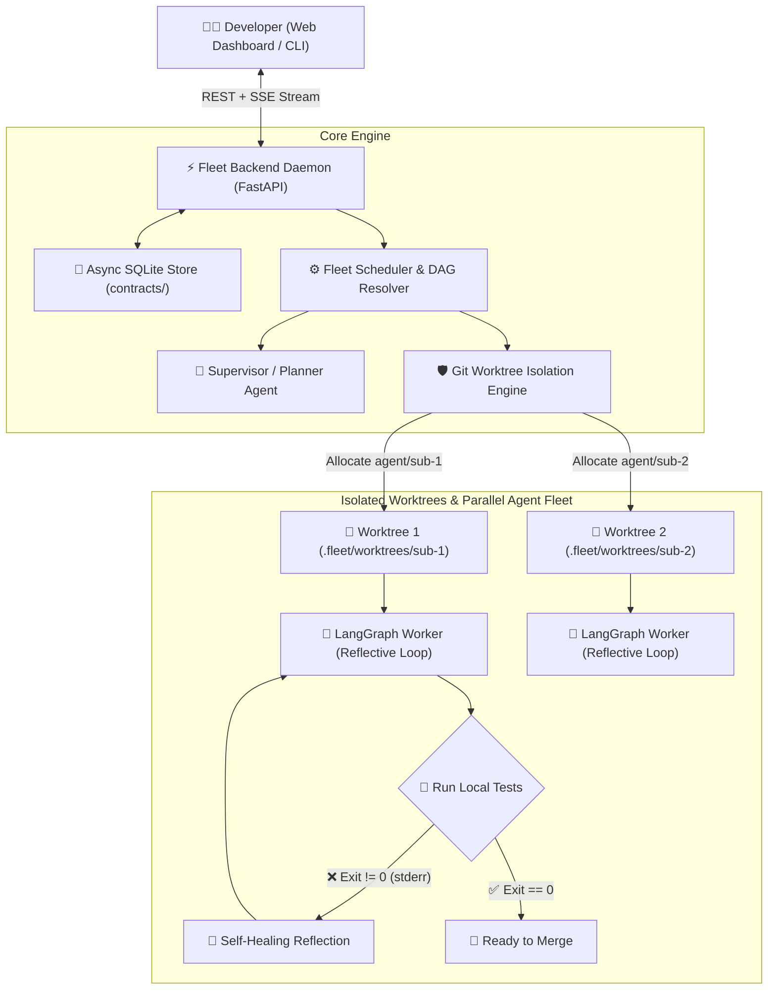

<div align="center">

# 🚀 Fleet Agent IDE

### *The Open-Source Multi-Agent Orchestrator with Git Worktree Isolation & Self-Healing Loops*

[](https://github.com/DrowLink/fleet-agent-ide/actions)
[](https://www.python.org/downloads/)
[](LICENSE)
[](https://langchain-ai.github.io/langgraph/)
[](https://fastapi.tiangolo.com/)

<br />

**Run fleets of autonomous AI coding agents concurrently on your local repository with zero file collisions, zero git locks, and zero Docker latency.**

[Quickstart](#-quickstart-in-3-minutes) • [Superpowers](#-superpowers) • [Web Dashboard](#-web-dashboard) • [Architecture](#-architecture) • [Documentation](docs/)

</div>

---

## ⚡ The Problem: Why Traditional AI Coding Tools Get Stuck

Most developer AI tools modify your active branch directly or run inside heavy virtual containers:
* 🛑 **You can only run 1 task at a time** — your editor gets locked while the agent works.
* 💥 **Multi-agent execution causes merge chaos** — agents overwrite each other's files and trigger `.git/index.lock` errors.
* 🐢 **Docker/VMs are slow and resource-heavy** — wasting 10GB of RAM and taking 15s to start.

---

## 💡 The Fleet Solution: Native Git Worktrees + LangGraph

**Fleet Agent IDE** replaces heavy containers with native **Git Worktree Isolation**:



1. **Instant Spawning (<50ms)**: Spawns independent physical working copies on dedicated branches (`agent/<task-id>`).
2. **Autonomous Self-Healing Loop**: The agent runs your local tests (`pytest`, `npm test`, `cargo test`), intercepts `stderr`, and fixes bugs iteratively before notifying you.
3. **Works 100% Offline with Ollama ($0 Tokens) or Free Gemini 2.0 Flash**: Zero required paid subscriptions.
4. **Live Web Dashboard & Diff Viewer**: Track agents in a multi-column Kanban board and inspect side-by-side Monaco diffs before merging.

---

## 🖥️ Web Dashboard

The Fleet Web Dashboard (`web/`) provides a visual control room for your agent fleet:

* 📊 **Multi-Agent Kanban Board**: Real-time state columns (*Planning*, *Working*, *Self-Correction Loop*, *Ready to Merge*).
* 🔍 **Monaco Diff Inspector**: Side-by-side git diff viewer with syntax highlighting and 1-click `[Merge to Main]`.
* 📺 **Live SSE Terminal Streamer**: Watch agents execute tests and see `stdout`/`stderr` streamed live.

---

## 🚀 Quickstart in 3 Minutes

### 1. Clone and Install
```bash
git clone https://github.com/DrowLink/fleet-agent-ide.git
cd fleet-agent-ide

# Create & activate environment
python -m venv .venv
# On Windows: .venv\Scripts\Activate.ps1
# On Linux/macOS: source .venv/bin/activate

# Install packages in editable mode
pip install -e "./contracts"
pip install -e "./backend"
pip install -e "./cli"
```

### 2. Configure Your LLM (Free Gemini or Offline Ollama)
Create a `.env` file in the root:

```env
# Option A: 100% Free Gemini Flash (1,500 daily requests via Google AI Studio)
LLM_PROVIDER="google"
GOOGLE_API_KEY="your-google-ai-studio-key"

# Option B: 100% Offline Local via Ollama ($0 tokens)
# LLM_PROVIDER="ollama"
# OLLAMA_MODEL="qwen2.5-coder:7b"
```

### 3. Launch the Daemon & Web Dashboard
```bash
# Terminal 1: Start Backend Daemon
fleet daemon --port 8000

# Terminal 2: Start Web UI
cd web
npm install
npm run dev
```

Open **`http://localhost:5173`** in your browser!

---

## 💻 CLI Usage (Terminal-First Developers)

```bash
# Dispatch a new task to the fleet
fleet run "Refactor authentication middleware to use JWT" --title "JWT Auth"

# Inspect task lifecycle statuses
fleet status

# View currently active Git worktrees
fleet worktrees
```

---

## 📂 Monorepo Architecture

```text
fleet-agent-ide/
├── contracts/                         # 📜 Typed Pydantic schemas (Tasks, Events, Harnesses)
├── backend/                           # 🧠 FastAPI Daemon, Worktree Manager & LangGraph
├── cli/                               # 💻 Typer + Rich Terminal Interface
├── web/                               # 🖥️ React + Vite + Tailwind + Monaco Dashboard
├── docs/                              # 📚 Architecture Decision Records (ADRs) & Guides
│   ├── adr/                           # ADR 0001 (Worktrees), ADR 0002 (SSE), ADR 0003 (Loops)
│   └── superpowers/                   # Deep dives into core capabilities
├── AGENTS.md                          # 🤖 Operational context for AI coding agents
├── CLAUDE.md                          # 📋 Claude Code conventions & commands
├── CONTEXT.md                         # 🌐 Deep domain and distributed system context
├── DESIGN.md                          # 🎨 UI/UX design tokens and component specs
├── CONTRIBUTING.md                    # 🤝 Contributor guidelines & PR etiquette
└── LICENSE                            # 📄 MIT License
```

---

## 🗺️ Roadmap

- [x] Git Worktree Isolation Engine
- [x] LangGraph Self-Correction Feedback Loop
- [x] FastAPI Daemon with REST + SSE Streaming
- [x] Interactive Terminal CLI (`fleet run`, `fleet status`)
- [x] React + Vite + Monaco Web Dashboard
- [x] Ollama Local Offline & Google AI Studio Free Tier Support
- [ ] Tree-Sitter Repository Map Generator (Aider-style AST indexing)
- [ ] Surgical `Search/Replace` Patch Engine
- [ ] Automated Multi-Branch Merge Queue with Conflict Resolution Agent

---

## 🤝 Contributing

We welcome contributions of all kinds! Please check out [CONTRIBUTING.md](CONTRIBUTING.md) to get started.

## 📄 License

Distributed under the MIT License. See [LICENSE](LICENSE) for more information.
