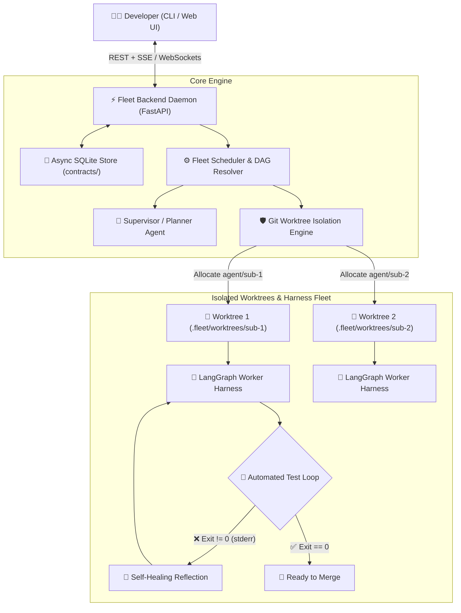

<div align="center">

# 🚀 Fleet Agent IDE

### *Autonomous Multi-Agent Local Orchestrator with Git Worktree Isolation & LangGraph*

[](https://github.com/your-org/fleet-agent-ide/actions)
[](https://www.python.org/downloads/)
[](https://opensource.org/licenses/MIT)
[](https://discord.gg/)

**Run fleets of autonomous AI coding agents in parallel on your local codebase without git locks, file collisions, or Docker latency.**

[Key Features](#-superpowers) • [Architecture](#-architecture) • [Quickstart](#-quickstart) • [Documentation](docs/) • [Contributing](docs/development.md)

---

</div>

## 💡 What is Fleet Agent IDE?

Most AI coding agents modify your current branch directly or run inside heavy Docker containers. **Fleet Agent IDE** introduces a high-performance, zero-latency execution engine powered by **Git Worktrees** and **LangGraph**:

1. **Instant Worktree Isolation**: Spawns isolated local working copies (`agent/<task-id>`) in milliseconds with zero Docker overhead.
2. **Supervisor-Worker DAG Orchestration**: Automatically breaks complex user goals into atomic subtasks with dependency management.
3. **Autonomous Self-Correction Loop**: Validates code with real local test commands (`pytest`, `ruff`), intercepting `stderr` to iteratively self-heal code.
4. **Contract-Driven Daemon**: Real-time state persistence in SQLite with live SSE and WebSocket streaming for terminal and web UIs.

---

## 🏛️ Architecture



---

## 📂 Monorepo Layout

```text
fleet-agent-ide/
├── contracts/                         # 📜 Typed Pydantic schemas shared across Daemon & Clients
│   ├── tasks.py                       # Task, SubTask, DAG and TaskStatus models
│   ├── events.py                      # SSE / WebSocket streaming event contracts
│   └── harness.py                     # Pluggable Agent Harness Protocol
├── backend/                           # 🧠 Execution Engine & Daemon Service
│   ├── src/fleet_backend/
│   │   ├── core/                      # Worktree isolation manager & SQLite store
│   │   ├── harnesses/                 # Pluggable agent drivers (LangGraph, Claude, PTY)
│   │   ├── orchestration/             # Supervisor planner and concurrent DAG scheduler
│   │   └── api/                       # FastAPI REST, SSE, and WebSocket server
│   └── pyproject.toml
├── cli/                               # 💻 Rich Interactive Terminal Client
│   ├── src/fleet_cli/                 # Typer + Rich terminal commands
│   └── pyproject.toml
├── docs/                              # 📚 Comprehensive Documentation
│   ├── adr/                           # Architecture Decision Records (0001-0003)
│   ├── superpowers/                   # Deep dives into core capabilities
│   ├── architecture.md                # System design & topography
│   └── development.md                 # Contributor guide & local setup
└── tests/                             # Integration & Unit test suite
```

---

## ⚡ Quickstart

### 1. Installation

```bash
# Clone the repository
git clone https://github.com/your-org/fleet-agent-ide.git
cd fleet-agent-ide

# Install in editable mode
pip install -e "./contracts"
pip install -e "./backend"
pip install -e "./cli"
```

### 2. Start the Daemon

```bash
fleet daemon --port 8000
```

### 3. Run a Task Fleet

```bash
fleet run "Refactor authentication middleware to use JWT and add unit tests" --title "Auth Refactor"
```

### 4. Inspect Fleet State

```bash
# List tasks and execution statuses
fleet status

# View currently active Git worktrees
fleet worktrees
```

---

## 📚 Documentation & ADRs

- [Architecture Topography](docs/architecture.md)
- [ADR 0001: Git Worktree Isolation vs Containers](docs/adr/0001-git-worktree-isolation.md)
- [ADR 0002: Contract-Driven Real-time Streaming](docs/adr/0002-contract-driven-streaming.md)
- [ADR 0003: LangGraph Self-Healing Feedback Loop](docs/adr/0003-langgraph-self-healing-loop.md)
- [Superpower: Zero-Collision Fleets](docs/superpowers/01-zero-collision-fleets.md)
- [Superpower: Autonomous Test Loops](docs/superpowers/02-self-correcting-test-loops.md)

---

## 🤝 Contributing

Contributions are warmly welcomed! Please read our [Development Guide](docs/development.md) to get started.

## 📄 License

This project is licensed under the MIT License - see the [LICENSE](LICENSE) file for details.
